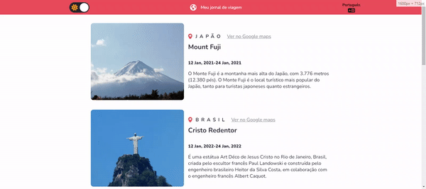
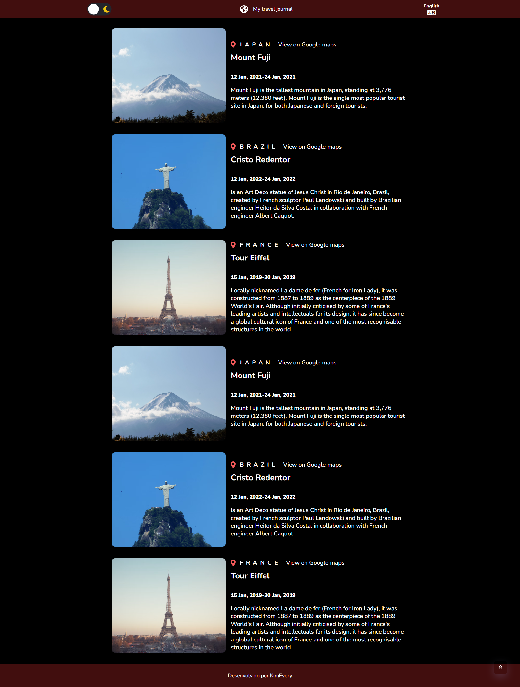
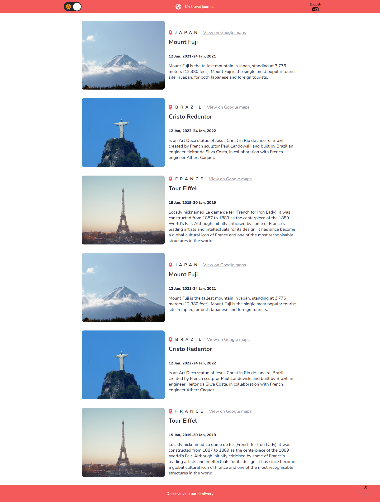

# Travel-Jonery

## 🎥 
<h1 align="center">
  
</h1>

## 🌑 Dark Mode
<h1 align="center">
  
</h1>

## ☀️ Light Mode
<h1 align="center">
  
</h1>

## 🚀 Tecnologias

Esse projeto foi desenvolvido com as seguintes tecnologias:

  - React
  - Vite
  - CSS 
  - HTML
  - JS
  - i18n - react-i18next
  - [AOS - Animate on scroll library](https://github.com/michalsnik/aos)
  - [react-scroll-to-top](https://github.com/HermanNygaard/react-scroll-to-top)

## 💻 Projeto

  - Projedo desenvovido em react, proposto como segundo challange do curso de react na [Scrimbra](https://scrimba.com/learn/learnreact).
  - Uma pagina utilando .map() para popular a partir de um arquivo jQuery
  - Dark e Light mode usando useState e localhost
  - Multi idiomas (português, inglês)
  
    
## 🔖 Layout
Você pode visualizar o projeto  através [desse link](https://travel-journal-mu.vercel.app/).
